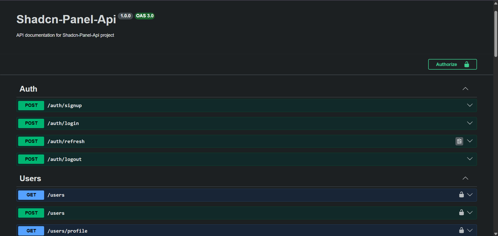

# Shadcn Panel API

This is a **NestJS + TypeScript** backend project using **TypeORM** and **PostgreSQL**.

I built this API for an admin/user panel with **JWT authentication**, **refresh token rotation**, **role-based authorization**, and a ticketing system.

The project includes **Swagger documentation** for testing and exploring all API endpoints.

Users can authenticate, refresh expired access tokens, manage their profile, create tickets, and interact with related entities such as city and state.

The authentication system stores refresh tokens in the database and automatically removes expired tokens.

I also implemented **custom guards**, **decorators**, **audit logging**, and reusable query utilities for pagination, ordering, and searching.

---

## Features

- JWT Authentication
- Refresh Token Rotation
- Automatic Expired Token Cleanup
- User CRUD
- Ticket & Message System
- Role-Based Authorization
- Custom Guards & Decorators
- Audit Interceptor
- Pagination / Search / Ordering
- Swagger API Documentation

---

## Database Entities

- **User**
- **RefreshToken**
- **Ticket**
- **Message**
- **City**
- **State**

---

## Authentication Flow

The project uses **access token + refresh token authentication**.

After login:

- Access token is generated
- Refresh token is stored in database
- Tokens are returned to client

When access token expires:

- Client sends refresh token
- Token is validated
- New access token is issued

Expired refresh tokens are automatically deleted.

---

## Project Structure

```
src
├── audit
├── common
│   └── query
├── decorator
├── entity
├── guard
├── interceptors
└── modules
    ├── auth
    ├── users
    ├── ticket
    └── address
```

---

## Tech Stack

- **NestJS**
- **TypeScript**
- **TypeORM**
- **PostgreSQL**
- **Passport JWT**
- **Swagger**
- **Class Validator**

---

## Environment Variables

Create a `.env` file:

```env
PORT=3000

DB_HOST=localhost
DB_PORT=5432
DB_USERNAME=postgres
DB_PASSWORD=your_password
DB_NAME=shadcn_panel

JWT_SECRET=your_jwt_secret
```

---

## Database Setup

Create the PostgreSQL database:

```sql
CREATE DATABASE shadcn_panel;
```

---

## Swagger Documentation

After running the project:

```bash
http://localhost:3000/api
```



---

## How to Run

1. Clone the repository:

```bash
git clone https://github.com/mandanaD/shadcn-panel-api.git
```

2. Install dependencies:

```bash
npm install
```

3. Run development server:

```bash
npm run start:dev
```

4. Open:

```bash
http://localhost:3000
```